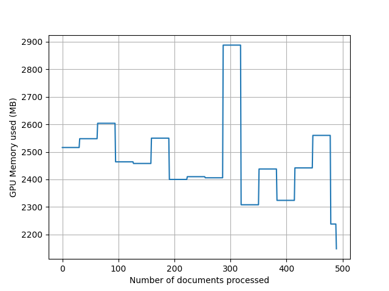
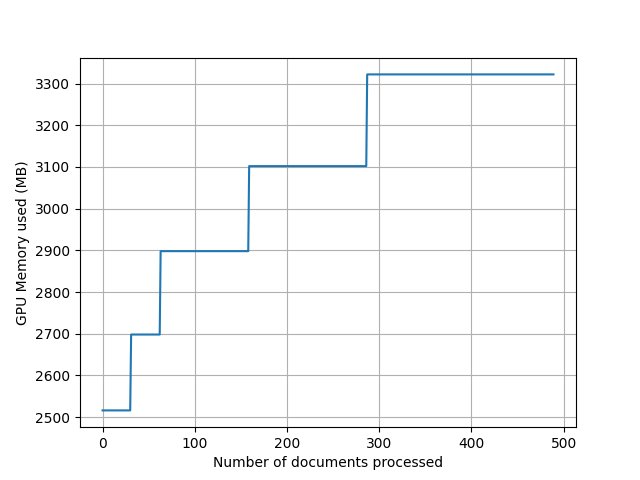

# stanza-batch

<p align="center">
    <a href="https://github.com/apmoore1/stanza-batch/actions?query=workflow%3Atest-action"> </a>
    <a href="https://codecov.io/gh/apmoore1/stanza-batch"> </a>
    <a href="https://github.com/apmoore1/stanza-batch/blob/main/LICENSE"> </a>
</p>

## Quick links

1. [Introduction](#introduction)
2. [Installation](#installation)
3. [Edge cases](#edge-cases)
4. [Handling Out Of Memory (OOM) errors](#handling-out-of-memory-(oom)-errors)
5. [Developing/Testing](#developingtesting)
6. [Memory management](#memory-management)
7. [Acknowledgements](#acknowledgements)

## Introduction

**Currently supports [Stanza](https://github.com/stanfordnlp/stanza) version 1.1.1 and 1.2.0**


Is a batching utility for [Stanza](https://github.com/stanfordnlp/stanza) making processing documents/texts with Stanza quicker and easier. The current recommendation for batching by [Stanza is to concatenate documents together with each document separated by a blank line (`\n\n`)](https://github.com/stanfordnlp/stanza#batching-to-maximize-pipeline-speed). This way of batching has one main drawback:

1. The return of processing this document is one Stanza Document with lots of sentences, thus you don't know where one document ends and another starts, easily.

This batching utility solves this problem, when given a list of documents, it will return a list of corresponding processed Stanza documents. Below we show a comparison of the current Stanza batching system and how batching works with this utility:

```python
import stanza
from stanza.models.common.doc import Document
# Documents to process
document_1 = 'Hello how are you\n\nI am good thank you'
document_2 = 'This is a different document'
# Create the document batch
batch_document = '\n\n'.join([document_1, document_2])
# Download Stanza English model
stanza.download("en")
# stanza model
nlp = stanza.Pipeline(lang="en", processors="tokenize",)
stanza_batch = nlp(batch_document)
assert isinstance(stanza_batch, Document)
stanza_document = 'Hello how are you\n\nI am good thank you\n\nThis is a different document'
assert stanza_batch.text == stanza_document
assert len(stanza_batch.sentences) == 3

# Using Stanza Batch
from typing import List
from stanza_batch import batch
stanza_documents: List[Document] = []
for document in batch([document_1, document_2], nlp, batch_size=32): # Default batch size is 32
    stanza_documents.append(document)
assert len(stanza_documents) == 2 # 2 Documents after processing
# Each document contains the same raw text after processing
assert stanza_documents[0].text == document_1 
assert stanza_documents[1].text == document_2
# Each document contains the expected number of sentences
assert len(stanza_documents[0].sentences) == 2
assert len(stanza_documents[1].sentences) == 1
```

As we can see above the new `batch` function yields corresponding processed documents from the given iterable `[document_1, document_2]`. Compared to the original version which only yields one processed document for all the documents in the iterable.

## Installation

Requires Python 3.6.1 or later. As the package depends on [Stanza](https://github.com/stanfordnlp/stanza) which also depends on [PyTorch](https://pytorch.org/) we recommend that you install the version of PyTorch that suits your setup first (e.g. CPU or GPU PyTorch and then if GPU a specific CUDA version).

``` bash
pip install .
```

## Edge cases

The way `stanza-batch` performs batching it does so by making use of the `\n\n` batching approaching, but it keeps track of the documents given to the batch process. However by making use of the `\n\n` batching approach and other assumptions it does come with some edge cases. All of these edge cases will mean that the length of the document in characters will be different as whitespace is removed from the documents, but content characters will not be removed:

### Removal of whitespace at the start and end of documents

As we only keep track of token offsets any whitespace at the start or end of document will be removed:
```python
import stanza
from stanza_batch import batch
# Download Stanza English model
stanza.download("en")
# stanza model
nlp = stanza.Pipeline(lang="en", processors="tokenize",)
document_1 = '\n  Hello how are you\n\nI am good thank you  \n'
stanza_document = [doc for doc in batch([document_1], nlp)][0]
assert stanza_document.text == 'Hello how are you\n\nI am good thank you'
```

### Swapping of whitespace characters

The batching approach does not actually split on `\n\n` it actually makes use of the following regex `\n\s*\n`, to ensure that we can keep track of which Stanza sentence belongs to which document we split each document with this regex and replace that whitespace with `\n\n`. Therefore this means that if you had a document that contains `\n  \n` this will be replaced with `\n\n`:
```python
import stanza
from stanza_batch import batch
# Download Stanza English model
stanza.download("en")
# stanza model
nlp = stanza.Pipeline(lang="en", processors="tokenize",)
document_1 = 'Hello how are you\n \n \nI am good thank you'
stanza_document = [doc for doc in batch([document_1], nlp)][0]
assert stanza_document.text == 'Hello how are you\n\nI am good thank you'
```

## Handling Out Of Memory (OOM) errors

When batching for inference you normally want the largest possible batch size without causing an OOM (for either CPU or GPU memory). A package that I found useful for this is the [toma package](https://github.com/BlackHC/toma). The [`toma.simple.batch` method](https://github.com/BlackHC/toma/blob/master/toma/__init__.py#L25) wraps a function and if a RuntimeError is caused it will reduce the batch size by half and re-run the function until it finishes or it causes another RuntimeError and then the process is repeated. Example of how to use it with this project, in this example we use part of the Jane Austin Emma book as the text data which can be found in the test data [./tests/data/jane_austin_emma_data.txt](./tests/data/jane_austin_emma_data.txt):
```python
from typing import List
from pathlib import Path
import stanza
from stanza.models.common.doc import Document
import toma

from stanza_batch import batch

# toma requires the first argument of the method to be the batch size
def run_batch(batch_size: int, stanza_nlp: stanza.Pipeline, data: List[str]
              ) -> List[Document]:
    # So that we can see what the batch size changes to.
    print(batch_size)
    return [doc for doc in batch(data, stanza_nlp, batch_size=batch_size)]

emma_fp = Path(__file__, '..', 'tests', 'data', 'jane_austin_emma_data.txt').resolve()
jane_austin_data: List[str] = []
with emma_fp.open('r') as emma_file:
    jane_austin_data = [line for line in emma_file]
# Make the text much larger to cause OOM
jane_austin_data = jane_austin_data * 5
assert len(jane_austin_data) == 2450
# Download Stanza English model
stanza.download("en")
# We set the initial batchsize as 500 and add POS and NER tagging
nlp = stanza.Pipeline(lang="en", processors="tokenize,pos,ner", 
                      tokenize_batch_size=500,
                      ner_batch_size=500,)

processed_documents: List[Document] = toma.simple.batch(run_batch, 500, 
                                                        nlp, jane_austin_data)
assert len(processed_documents) == 2450
```
Running this code on my local machine which had 16GB RAM and Nvidia 1060 6GB GPU reduces the batch size from 500 to 62 and took around 102 seconds to run. If I had ran this code knowing 62 is close to the largest batch size that my computer can mange the code would have taken 90 seconds (keeping the ner_batch_size=500 but all others to 62), showing the time/processing cost of causing an OOM exception.

## Developing/Testing

This code base uses `flake8`, `mypy`, and `black` to ensure that the format of the code is consistent. The `flake8` defaults ([./.flake8](./.flake8)) are the same as those in the [Spacy project](https://github.com/explosion/spaCy/blob/master/setup.cfg#L94) and the `black` defaults follow those as well. The `mypy` requirements is mainly here due to my own preference on having type hints in the code base.

To install all of these requirements:
```bash
pip install -r dev-requirements.txt
```

To use black, flake8, mypy, and pytest use the following commands:
``` bash
black --exclude profile_stanza.py --line-length 80 .
flake8 .
mypy
python -m pytest --cov=stanza_batch --cov-report term-missing
```

The flake8, mypy, and pytest have to pass whereby the pytest test coverage should be 100% for a pull request to be accepted. If these requirements are not met in your pull request we will work with you to resolve any issues, so please do not get put off creating a pull request if you cannot pass any/all of these requirements.

## Memory management

One of the arguments to `batch` is `clear_cache` which clears the GPU memory after every batch. This is important as Python often does not clear this up quickly this can quickly cause an Out Of Memory (OOM) problem. Below we profile the `batch` function using `clear_cache` and not. For this we use [gputil](https://github.com/anderskm/gputil):
```python
import argparse
from pathlib import Path
from typing import List
from time import time
from pathlib import Path

import stanza
from stanza.models.common.doc import Document
import stanza_batch
import GPUtil
import matplotlib.pyplot as plt

def path_type(fp: str) -> Path:
    return Path(fp).resolve()

if __name__ == "__main__":
    save_fp_help = ('File path to save the GPU memory as a '
                    'function of documents processed plot. '
                    'As we have to get the GPU memory usage for each '
                    'document this slows the program down a lot.')
    parser = argparse.ArgumentParser()
    parser.add_argument('--save-fp', help=save_fp_help, type=path_type)
    parser.add_argument('--clear-cache', action='store_true')
    args = parser.parse_args()

    stanza.download("en", processors="tokenize,pos,sentiment")
    nlp = stanza.Pipeline(
        lang="en", processors="tokenize,pos,sentiment", use_gpu=True
    )

    book_data: List[str] = []
    test_data_dir = Path(__file__, "..", "tests", "data").resolve()
    with Path(test_data_dir, "jane_austin_emma_data.txt").open(
        "r"
    ) as emma_file:
        book_data = [line for line in emma_file]
    assert len(book_data) == 490

    t = time()
    gpu_memory_used: List[float] = []
    processed_book_data: List[Document] = []
    for document in stanza_batch.batch(book_data, nlp, clear_cache=args.clear_cache):
        processed_book_data.append(document)
        if args.save_fp:
            # assuming the first GPU is the one being used.
            gpu_memory_used.append(GPUtil.getGPUs()[0].memoryUsed)
    print(f'Time taken: {time() - t}')

    if args.save_fp:
        number_documents_processed = range(len(processed_book_data))
        plt.plot(number_documents_processed, gpu_memory_used)
        plt.xlabel('Number of documents processed')
        plt.ylabel('GPU Memory used (MB)')
        plt.grid(True)
        plt.savefig(str(args.save_fp))
```

To run the following need to install `gputil`:
```bash
pip install "gputil>=1.4.0"
```

As we can see below using the `clear_cache` does uses less memory overall and has a lower maximum GPU memory usage, there is a slight time plenty of 2% but that could be due to other factors and is marginal compared to the memory difference of maximum GPU usage of <3200MB for `clear_cache` compared to just over 3400MB for not using `clear_cache` (at least 6% difference). Furthermore the `clear_cache` does not accumulate GPU memory thus over a larger job the memory issue for **not** using `clear_cache` will just keep getting worse.

### Clear cache = True
```bash
python profile_stanza.py --clear-cache --save-fp ./gpu_profile_plots/clear_cache.png
```

Ignore the time that comes from this as sampling the memory usage takes a long time. To get the time taken to run this script use the script without `--save-fp`:

```bash
python profile_stanza.py --clear-cache
```

Time taken: 11.91

GPU memory usage plot:



### Clear cache = False
```bash
python profile_stanza.py --save-fp ./gpu_profile_plots/non_clear_cache.png
```

Ignore the time that comes from this as sampling the memory usage takes a long time. To get the time taken to run this script use the script without `--save-fp`:

```bash
python profile_stanza.py
```

Time taken: 11.61

GPU memory usage plot:



## Acknowledgements

This work has been funded through the [UCREL research centre at Lancaster University](http://ucrel.lancs.ac.uk/).
